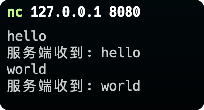
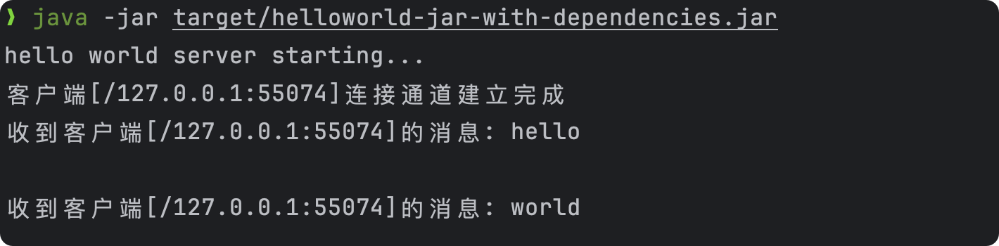

# helloworld
用于演示使用 epoll 实现一个服务端程序，能够支持百万级客户端连接

## 使用
使用步骤：

1. 执行maven打包： mvn clean package
2. 将target下的helloworld-jar-with-dependencies.jar 包copy到linux服务器
3. 执行 java -jar helloworld-jar-with-dependencies.jar 
4. 连接到服务8080端口即可

### 演示
前提：服务启动

1. 客户端连接服务端，并发送信息

2. 服务接收消息，并返回

## 代码说明
* MessageService：模拟数据处理流程
* MyChannelService：管理连接
* MyHandler： 处理请求
* Application： 应用启动入口
  * 使用了1个boss线程
  * 使用了8个worker线程
* 其它需要的功能可在此基础上扩展即可